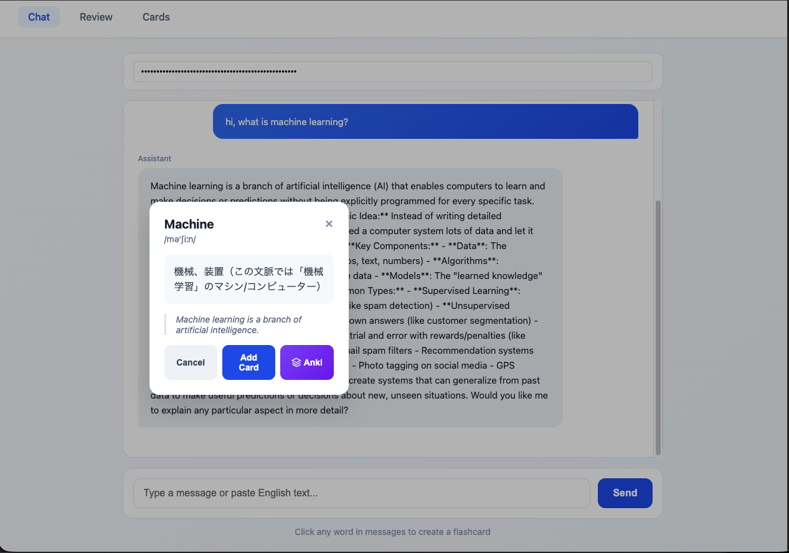

# Memory Anki - AI-Powered Flashcard SaaS

> AIチャットで学んだ内容を自動でフラッシュカード化し、SM-2アルゴリズムで効率的に復習できるWebアプリケーション


## Demo

<!-- デモURLまたはGIF/動画を追加 -->
🔗 **Live Demo**: [Coming Soon]

📹 **Demo Video**: [Coming Soon]

## Screenshots

<table>
  <tr>
    <td></td>
    <td></td>
    <td></td>
  </tr>
  <tr>
    <td align="center"><b>Chat - 単語をクリックしてカード作成</b></td>
    <td align="center"><b>Review - フリップカードで復習</b></td>
    <td align="center"><b>Cards - カード管理</b></td>
  </tr>
</table>

## Features

- 🤖 **AIチャット**: Claude APIを使った自然な英語学習対話
- 📝 **ワンクリックカード作成**: 会話中の単語をクリックするだけでフラッシュカード化
- 🧠 **SM-2アルゴリズム**: 科学的な間隔反復で効率的に記憶定着
- 🎴 **フリップカードUI**: アニメーション付きの直感的な復習体験
- 📊 **学習進捗管理**: 復習スケジュールと統計の可視化

## Architecture

```
┌─────────────────────────────────────────────────────────────┐
│                        Frontend                              │
│                   (HTML/CSS/JavaScript)                      │
│         ┌─────────┐ ┌─────────┐ ┌─────────┐                │
│         │  Chat   │ │ Review  │ │  Cards  │                │
│         └────┬────┘ └────┬────┘ └────┬────┘                │
└──────────────┼───────────┼───────────┼──────────────────────┘
               │           │           │
               ▼           ▼           ▼
┌─────────────────────────────────────────────────────────────┐
│                     FastAPI Backend                          │
│  ┌──────────┐ ┌──────────┐ ┌──────────┐ ┌──────────┐       │
│  │  /chat   │ │ /lookup  │ │ /review  │ │  /cards  │       │
│  └────┬─────┘ └────┬─────┘ └────┬─────┘ └────┬─────┘       │
│       │            │            │            │              │
│  ┌────▼────────────▼────────────▼────────────▼────┐        │
│  │              Business Logic                     │        │
│  │  ┌─────────┐ ┌─────────┐ ┌─────────────────┐  │        │
│  │  │ Claude  │ │  Word   │ │  SM-2 Algorithm │  │        │
│  │  │ Service │ │ Lookup  │ │                 │  │        │
│  │  └────┬────┘ └─────────┘ └─────────────────┘  │        │
│  └───────┼───────────────────────────────────────┘        │
└──────────┼────────────────────────────────────────────────┘
           │
           ▼
┌──────────────────┐     ┌─────────────────────────────────┐
│   Claude API     │     │          PostgreSQL              │
│   (Anthropic)    │     │  ┌─────┐ ┌─────┐ ┌───────────┐ │
└──────────────────┘     │  │Users│ │Cards│ │ReviewLogs │ │
                         │  └─────┘ └─────┘ └───────────┘ │
                         └─────────────────────────────────┘
```

## Tech Stack

### Backend
| Technology | Purpose | Why chosen |
|------------|---------|------------|
| **FastAPI** | Web Framework | 高速、型安全、自動ドキュメント生成 |
| **SQLAlchemy** | ORM | 柔軟なクエリ、マイグレーション対応 |
| **PostgreSQL** | Database | 信頼性、スケーラビリティ |
| **Alembic** | Migration | スキーマ変更の追跡・管理 |
| **Claude API** | AI | 高品質な自然言語処理 |

### Frontend
| Technology | Purpose | Why chosen |
|------------|---------|------------|
| **Vanilla JS** | UI Logic | 軽量、依存なし、高速 |
| **CSS3** | Styling | アニメーション、レスポンシブ対応 |

### Infrastructure
| Technology | Purpose |
|------------|---------|
| **Docker** | コンテナ化 |
| **GitHub Actions** | CI/CD |
| **Railway** | Backend Hosting |
| **Vercel** | Frontend Hosting |

## SM-2 Algorithm

SuperMemoの間隔反復アルゴリズムを実装:

```python
def calculate_sm2(rating, repetitions, ease_factor, interval):
    """
    rating: 0=Again, 1=Hard, 2=Good, 3=Easy
    """
    if rating < 2:  # 失敗 → リセット
        repetitions = 0
        interval = 1
    else:  # 成功
        if repetitions == 0:
            interval = 1
        elif repetitions == 1:
            interval = 6
        else:
            interval = interval * ease_factor
        repetitions += 1

    # Easy bonus
    if rating == 3:
        interval *= 1.3

    return repetitions, ease_factor, interval
```

## API Endpoints

| Method | Endpoint | Description |
|--------|----------|-------------|
| GET | `/health` | ヘルスチェック |
| POST | `/chat` | AIとチャット |
| POST | `/lookup` | 単語の意味を取得 |
| POST | `/quick` | カードを即座に作成 |
| GET | `/cards` | カード一覧取得 |
| PUT | `/cards/{id}` | カード編集 |
| DELETE | `/cards/{id}` | カード削除 |
| GET | `/review/due` | 今日の復習カード |
| POST | `/review/{id}` | 復習結果を送信 |

## Getting Started

### Prerequisites

- Python 3.11+
- PostgreSQL 15+
- Docker (optional)

### Local Development

```bash
# 1. Clone repository
git clone https://github.com/ryo911-pors/memory-anki-project.git
cd memory-anki-project

# 2. Start PostgreSQL
docker-compose up -d

# 3. Setup Python environment
cd backend
python -m venv venv
source venv/bin/activate  # Windows: venv\Scripts\activate
pip install -r requirements.txt

# 4. Configure environment
cp .env.example .env
# Edit .env and set ANTHROPIC_API_KEY

# 5. Run migrations
alembic upgrade head

# 6. Create test user
python scripts/create_user.py
# Note the API Key output

# 7. Start API server
uvicorn app.main:app --reload

# 8. Start frontend (new terminal)
cd ../frontend
python -m http.server 3000
```

Access: http://localhost:3000

### Docker

```bash
# Set API key
export ANTHROPIC_API_KEY=your_key_here

# Start all services
docker-compose -f docker-compose.prod.yml up -d
```

## Testing

```bash
cd backend
pytest tests/ -v
```

## Deployment

### Backend (Railway)

1. Create Railway account
2. Connect GitHub repository
3. Set environment variables:
   - `DATABASE_URL` (Railway provides)
   - `ANTHROPIC_API_KEY`
4. Deploy

### Frontend (Vercel)

1. Create Vercel account
2. Import repository
3. Set root directory to `frontend`
4. Deploy

## Project Structure

```
memory-anki-project/
├── backend/
│   ├── app/
│   │   ├── main.py           # FastAPI entry point
│   │   ├── config.py         # Settings
│   │   ├── database.py       # DB connection
│   │   ├── models.py         # SQLAlchemy models
│   │   ├── schemas.py        # Pydantic schemas
│   │   ├── deps.py           # Dependencies (auth)
│   │   ├── routers/          # API endpoints
│   │   └── services/         # Business logic
│   ├── alembic/              # Migrations
│   ├── tests/                # Unit tests
│   ├── Dockerfile
│   └── requirements.txt
├── frontend/
│   ├── index.html            # Chat page
│   ├── review.html           # Review page
│   └── cards.html            # Cards page
├── docker-compose.yml
├── docker-compose.prod.yml
└── README.md
```

## Future Improvements

- [ ] ユーザー認証 (OAuth)
- [ ] モバイルアプリ (React Native)
- [ ] 音声読み上げ機能
- [ ] カードのインポート/エクスポート
- [ ] 学習統計ダッシュボード
- [ ] マルチ言語対応

## License

MIT License - see [LICENSE](LICENSE) file

## Author

**Ryo** - [GitHub](https://github.com/ryo911-pors)

---

<p align="center">
  Built with ❤️ using FastAPI and Claude API
</p>
